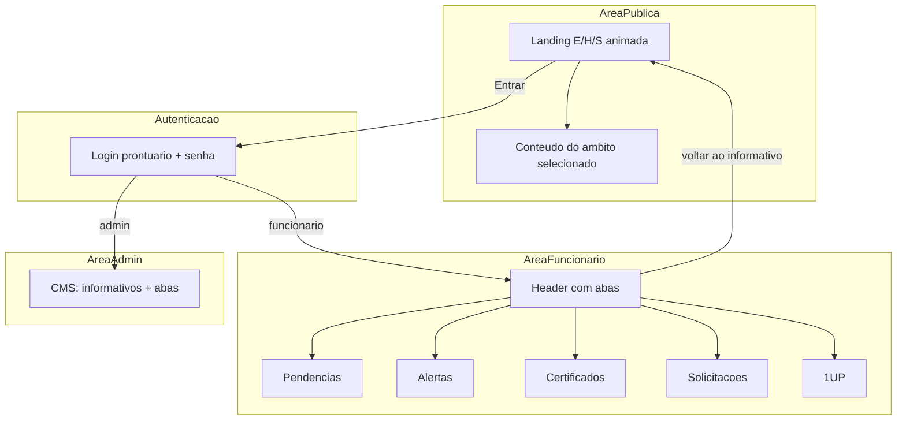
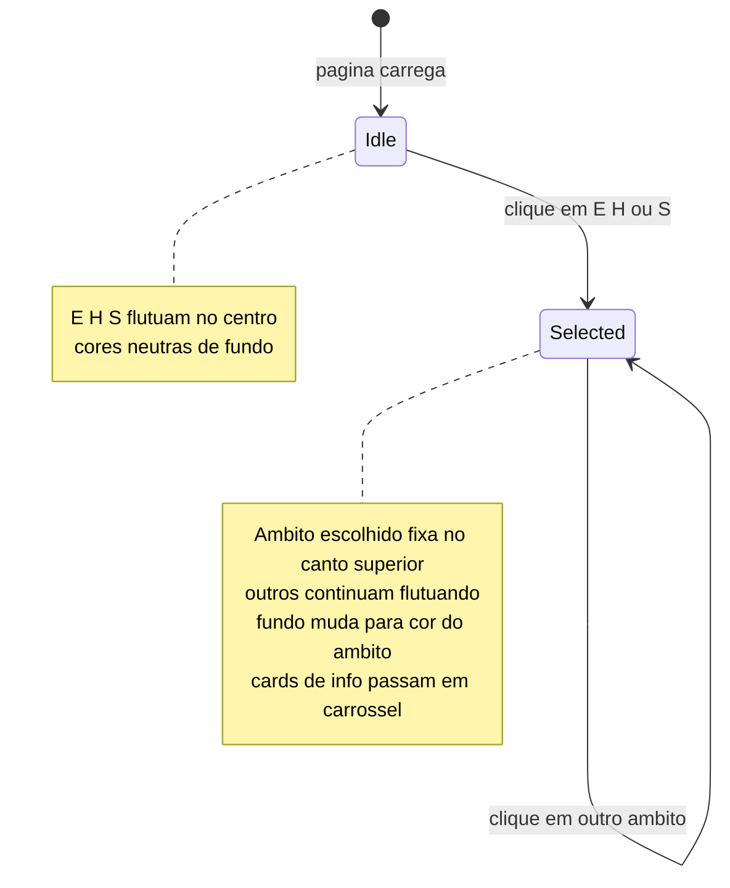

# Protótipo Site EHS — Plano de Implementação

## Visão geral da arquitetura



## Stack técnica

| Camada | Escolha |
|--------|---------|
| Framework | **Next.js 14** (App Router) + TypeScript |
| Estilo | **Tailwind CSS** + paleta por âmbito (E=verde, H=azul, S=laranja) |
| Animações | **Framer Motion** (letras flutuantes, transições de cor, fixação do item selecionado) |
| Banco | **Prisma + SQLite** (`dev.db` local — fácil de rodar; migrável para Supabase/Postgres depois) |
| Auth | Sessão via **NextAuth.js** (Credentials provider) ou cookie JWT simples — prontuário + senha |
| PDFs | Arquivos estáticos em `public/certificados/` + registro no banco |

## Estrutura de pastas proposta

```
projeto-ehs/
├── app/
│   ├── page.tsx                    # Landing pública E/H/S
│   ├── login/page.tsx
│   ├── app/page.tsx                # Área logada (header + abas + informativo)
│   ├── admin/page.tsx              # CMS admin
│   └── api/                        # Route handlers REST
├── components/
│   ├── ehs/
│   │   ├── EHSSelector.tsx         # Letras/emojis animados + seleção
│   │   ├── AmbitPanel.tsx          # Conteúdo deslizante do âmbito
│   │   └── ThemeProvider.tsx       # Troca de cores por âmbito
│   ├── layout/
│   │   ├── AppHeader.tsx           # Abas: Pendências, Alertas, etc.
│   │   └── TabContent.tsx
│   └── admin/
│       └── ContentForms.tsx
├── lib/
│   ├── prisma.ts
│   ├── auth.ts
│   └── seed.ts
├── prisma/
│   └── schema.prisma
└── public/certificados/            # PDFs de exemplo
```

## Modelo de dados (Prisma)

Entidades mínimas para o protótipo:

- **User** — `prontuario` (único), `passwordHash`, `name`, `role` (`EMPLOYEE` | `ADMIN`)
- **EHSContent** — `pillar` (`ENVIRONMENT` | `HEALTH` | `SAFETY`), `title`, `body`, `order`, `isPublic`
- **Pendencia** — `userId`, `title`, `description`, `status`, `dueDate`
- **Alerta** — `userId` (null = broadcast), `title`, `message`, `type`, `expiresAt`, `acknowledgedAt`
- **Certificado** — `userId`, `trainingName`, `filePath`, `issuedAt`
- **Solicitacao** — `userId`, `type` (chamado/reclamação/sugestão), `message`, `status`
- **Challenge** — `title`, `description`, `points`, `weekStart`, `active`
- **UserScore** — `userId`, `challengeId`, `points`, `completedAt`

**Seed inicial** ([`prisma/seed.ts`](prisma/seed.ts)):
- Admin: prontuário `admin`, senha `admin123`
- Funcionário teste: prontuário `12345`, senha `123456`
- Conteúdo E/H/S de exemplo (3–4 cards por âmbito)
- 2 pendências, 2 alertas, 1 certificado PDF, 1 desafio 1UP

## Telas e comportamento

### 1. Landing pública (`/`)

Comportamento central descrito pelo usuário:



Implementação em [`components/ehs/EHSSelector.tsx`](components/ehs/EHSSelector.tsx):
- Três elementos (`E` 🌿, `H` 💙, `S` 🦺) com `motion.div` em órbita/flutuação contínua
- Ao clicar: `layoutId` do Framer Motion move o selecionado para posição fixa (canto superior esquerdo)
- [`ThemeProvider`](components/ehs/ThemeProvider.tsx) aplica CSS variables: `--accent`, `--bg-gradient`
- [`AmbitPanel`](components/ehs/AmbitPanel.tsx) busca conteúdo via `GET /api/ehs?pillar=ENVIRONMENT` e exibe cards com auto-scroll ou navegação manual
- Botão **"Área do funcionário"** → `/login`

### 2. Login (`/login`)

- Campos: **Prontuário** + **Senha**
- Validação contra banco; mensagens de erro em português
- Nota visual: *"Biometria em breve — protótipo usa senha"*
- Redirect: `EMPLOYEE` → `/app`, `ADMIN` → `/admin`

### 3. Área logada (`/app`)

Mesma landing E/H/S **abaixo ou ao lado** do header fixo com abas:

| Aba | Protótipo MVP |
|-----|----------------|
| **Início** | Retorna ao seletor E/H/S (padrão ao entrar) |
| **Pendências** | Lista com status (aberta/concluída); botão "Resolver" marca como concluída |
| **Alertas** | Cards com prazo/tipo; botão **"Ciência"** grava `acknowledgedAt` |
| **Certificados** | Lista PDFs; preview inline; botões "Enviar e-mail" (mailto:) e "WhatsApp" (link `wa.me` com texto) |
| **Solicitações** | Formulário (tipo + mensagem) + histórico do usuário |
| **1UP** | Desafio da semana ativo; quiz simples (3 perguntas) ou checkbox "Concluí"; soma pontos em `UserScore`; ranking top 5 |

Header inclui nome do funcionário + **Sair**.

### 4. Painel Admin (`/admin`)

Aba extra **Administração** (rota separada `/admin`, protegida por role):

- **Informativos públicos**: CRUD de cards E/H/S (título, texto, ordem, âmbito)
- **Pendências / Alertas / Certificados**: criar e atribuir a prontuário(s) ou broadcast
- **Desafios 1UP**: criar desafio semanal com pontuação
- **Usuários**: cadastrar prontuário + nome + senha inicial (para testes)

UI simples: formulários + tabelas, sem design complexo — foco em funcionalidade.

## API Routes (protótipo)

| Método | Rota | Uso |
|--------|------|-----|
| GET | `/api/ehs` | Conteúdo público por pillar |
| POST | `/api/auth/login` | Login |
| POST | `/api/auth/logout` | Logout |
| GET/POST | `/api/pendencias` | Listar / criar (admin) / resolver |
| GET/POST/PATCH | `/api/alertas` | Listar / criar / dar ciência |
| GET | `/api/certificados` | Listar PDFs do usuário |
| GET/POST | `/api/solicitacoes` | Histórico / nova solicitação |
| GET/POST | `/api/challenges` | Desafio ativo / submeter resposta |
| GET | `/api/ranking` | Top 5 pontuadores 1UP |
| CRUD | `/api/admin/*` | Endpoints protegidos por role ADMIN |

Middleware em [`middleware.ts`](middleware.ts) protege `/app/*` e `/admin/*`.

## Identidade visual (protótipo)

- **Environment (E)**: verde `#22c55e`, emoji 🌿 / ícone folha
- **Health (H)**: azul `#3b82f6`, emoji ❤️ / ícone saúde
- **Safety (S)**: laranja `#f97316`, emoji 🦺 / ícone capacete
- Tipografia: **Inter** ou **DM Sans** — legível e corporativa
- Layout responsivo: mobile-first (funcionários acessam pelo celular)

## Escopo explícito FORA do protótipo v1

Deixar preparado visualmente, mas **não implementar agora**:
- Biometria / reconhecimento facial
- Envio real de e-mail (usar `mailto:` e WhatsApp deep link)
- Upload real de PDF pelo admin (usar PDF de exemplo pré-colocado)
- Notificações push
- Integração com RH/ERP

## Ordem de implementação

1. **Scaffold** — `create-next-app`, Tailwind, Prisma, seed, layout base
2. **Landing E/H/S** — animações + transição de tema + consumo da API pública
3. **Auth** — login, sessão, middleware, usuários seed
4. **Header + abas** — shell da área logada reutilizando landing
5. **Abas funcionais** — Pendências, Alertas (ciência), Certificados, Solicitações
6. **1UP** — desafio + pontuação + ranking
7. **Admin CMS** — CRUD de conteúdos e atribuições
8. **Polish** — responsividade, loading states, mensagens PT-BR

## Como rodar (após implementação)

```bash
npm install
npx prisma migrate dev
npx prisma db seed
npm run dev
```

Acesso: `http://localhost:3000` — funcionário `12345` / `123456`, admin `admin` / `admin123`.
